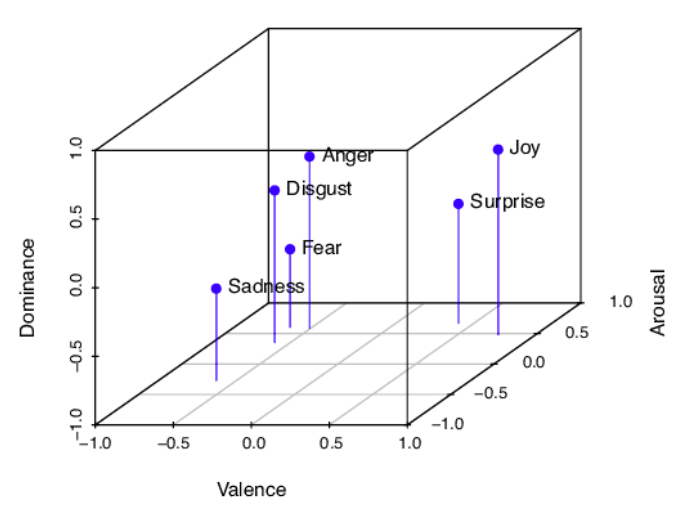
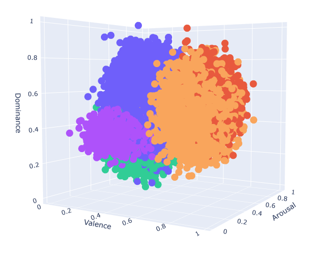
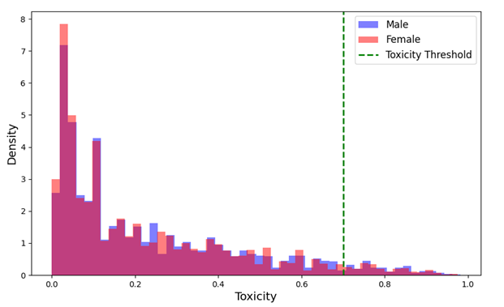
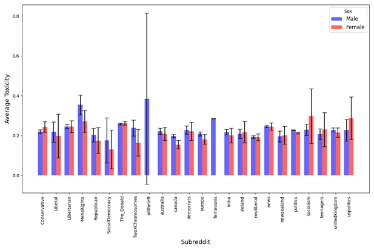
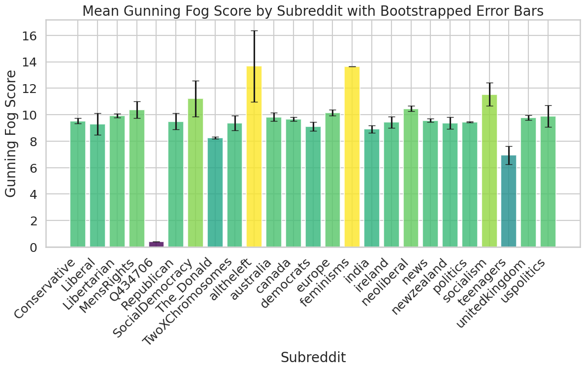
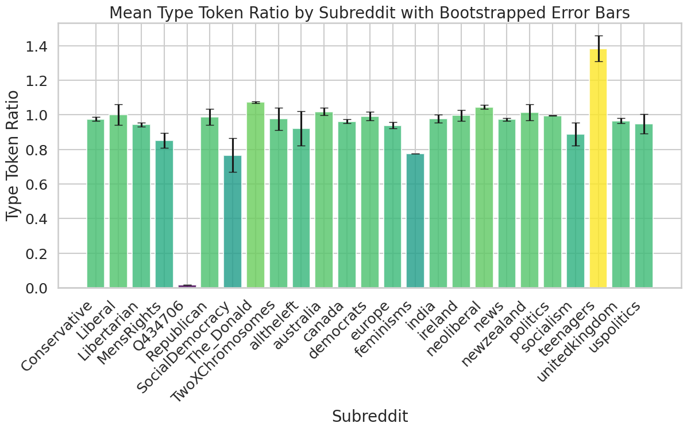
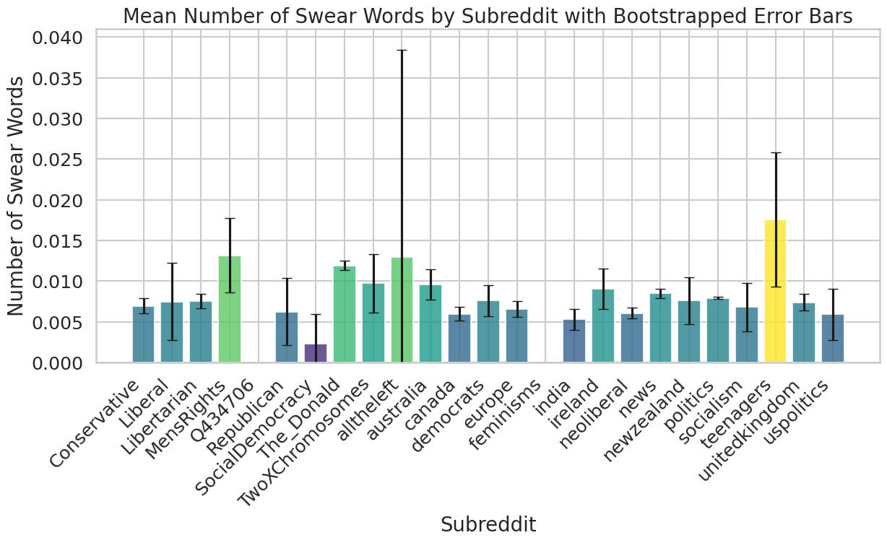
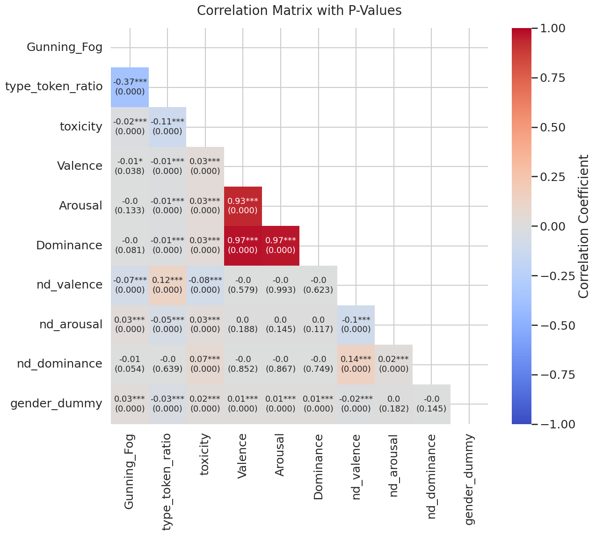

# Gender Bias in Online Discussions: Analyzing Sentiment and Text Complexity

Authors: [Andri Rutschmann](https://github.com/rutschmanna), [Peer Saleth](https://github.com/peersal) and [Jördis Strack](https://github.com/joerdisstrack)

The main repository to document all development and results of our final project for the seminar Research Projects in Computational Studies of Social Phenomena 

Please find our initial exposé, both the midway and final presentation slides as well as our code and final report here.
All data needed to replicate our project can be found [here](https://drive.proton.me/urls/FV0VWYE8WR#RbyRFJnhfVVV).

**Goal:** This project investigates the relationship between sentimental gender bias and text complexity in online discussions about U.S. politicians on Reddit. 

## Table of Contents
- Project Overview
- Methodology
- Hypotheses
- Results and Discussion
- How to Run the Code
- Data Access

## Project Overview
This project explores how gender bias manifests in the complexity of language used in Reddit posts discussing U.S. politicians. Building on prior research, we sought to understand if and how gender-biased language—measured through sentiment analysis and toxicity—correlates with the syntactic and semantic complexity of text. Our analysis was conducted on a dataset of approximately 137,000 Reddit posts, where we employed the LEIA VAD sentiment analyzer and the Perspective API to quantify emotional tone and toxicity. Contrary to our expectations, we found no substantial evidence that gender-biased or toxic posts are associated with lower text complexity.

**Data:**
The dataset we used stems from Marjanovic et al. (2022) and focuses on quantifying gender biases towards politicians on Reddit. Originally containing over 10 million posts, a random sample of approximately 137,000 posts was used due to computational limitations.

Marjanovic, S., Stánczak, K., & Augenstein, I. (2022). Quantifying gender biases towards politicians on Reddit (N. J. Shook, Ed.). PLOS ONE, 17 (10), e0274317.
https://doi.org/10.1371/journal.pone.0274317

## Methodology
The following tools and measures and applied:

**Sentiment Analysis:** LEIA VAD sentiment analyzer to evaluate the emotional tone (Valence, Arousal, Dominance).

The study of emotions can be approached in two ways: as discrete classes or as clusters in a multidimensional space, typically defined by valence, arousal, and dominance (VAD). Efforts have been made to unify these approaches, with Buechel and Hahn (2017) successfully mapping discrete sentiments to VAD dimensions. To examine gender bias in sentiment, the LEIA sentiment analyzer (Aroyehun et al., 2023) was used, showing strong performance in classifying emotions like anger, though it struggled with sadness. A manual validation showed LEIA’s F1 scores varied, with the best performance in anger and the worst in sadness. The study suggests LEIA is a valuable tool despite some limitations in classifying specific emotions.

A comparison between the sentiment mapping by Buechel & Hand (2017) and our LEIA-mapping:

  
  

LEIA Sentiment Analyzer: Aroyehun, S., Malik, L., Metzler, H., Haimerl, N., Natale, A., & Garcia, D. (2023). LEIA:
Linguistic Embeddings for the Identification of Affect. EPJ Data Science, 12. https:
//doi.org/10.1140/epjds/s13688-023-00427-0

Figure from: Sven, B., & Hahn, U. (2016). Emotion Analysis as a Regression Problem — Dimensional Models and Their Implications on Emotion Representation and Metrical Evaluation, 1114–1122. https://doi.org/doi:10.3233/978-1-61499-672-9-1114

**Toxicity Assessment:** Perspective API to measure the likelihood of a post being perceived as toxic.

The toxicity analysis, using the Perspective API, identified toxic comments with a probability score, showing strong performance metrics: 88% accuracy, 0.875 F1 Score, and 0.913 precision. The analysis found no substantial difference in mean toxicity scores between comments directed at males (0.23, 95% CI [0.23, 0.23]) and females (0.22, 95% CI [0.22, 0.22]), with a mean difference of -0.01 (95% CI [-0.01, -0.01]). Although the Mann-Whitney U Test (U = 1,105,051,493.0, p = 1.37e-11) indicated a significant difference in toxicity score distributions, the effect size was minimal. These findings suggest no significant evidence of accumulated hostile sexism towards women in the dataset. Additionally, toxic comments were slightly more common in comments targeting men, especially when considering the ratio of toxic to total comments.

To the left the right-skewed distribution of Reddit posts that were labeled as likely toxic and to the right the distribution of toxix Reddit posts by gender and over all Subbreddits.

  
  

**Text Complexity:** Gunning Fog Index for syntactic complexity and Type-Token Ratio (TTR) for semantic complexity.

Text complexity as the challenge involved in understanding a text, encompassing both syntactic and semantic aspects. This is assessed using the Gunning Fog index, which measures sentence complexity and vocabulary difficulty, and the type token ratio (TTR), which reflects vocabulary diversity. Higher Gunning Fog scores, found in subreddits like Republican and Feminisms, indicate more complex texts, while lower scores, such as those in Q434706, suggest simpler texts. TTR analysis shows that subreddits like Socialism and USPolitics use a wider range of vocabulary compared to subreddits like Republican and TwoXChromosomes. Additionally, profanity analysis using the better_profanity library reveals that subreddits such as MensRights and Teenagers have higher incidences of swear words, suggesting more offensive language compared to others like Q434706 and TwoXChromosomes, which have lower profanity rates.

An overview over the mean text complexity scores over all sampled subreddits:

  
  
  

We then conducted a correlation analysis to examine the relationships between sentiment, toxicity, and text complexity in posts discussing male and female politicians.

## Hypotheses
**H1:** Sentimentally gender-biased Reddit posts will display lower text complexity.
We anticipated that posts with higher emotional tone would be syntactically simpler but lexically richer.

**H2:** Toxic Reddit posts will exhibit lower text complexity.
We expected that posts perceived as toxic would show lower scores for both Gunning Fog and TTR.

**H3:** Toxicity and the LEIA VAD dimensions will correlate positively.
We hypothesized that higher toxicity would correspond to stronger emotional tone (higher arousal and dominance, lower valence).

## Results and Discussion

**H1: Sentiment and Text Complexity**

- **Valence:** Positively correlated with TTR (0.12, p < 0.000***) but negatively with Gunning Fog (−0.07, p < 0.000***), indicating simpler syntax but richer vocabulary in positive posts.
- **Arousal:** Contradicted the above with positive correlations with Gunning Fog (0.03, p < 0.000***) and negative with TTR (−0.05, p < 0.000***), suggesting more complex but lexically limited texts.
- **Dominance:** Results were not significant.

**H2: Toxicity and Text Complexity**

- **Toxicity:** Showed negative correlations with both Gunning Fog (−0.02, p < 0.000***) and TTR (−0.11, p < 0.000***), supporting the hypothesis that toxic language is simpler and less creative.

**H3: Toxicity and Sentiment**
- Toxicity vs. VAD: Mixed results, with toxicity negatively correlated with valence (−0.08, p < 0.000***) but positively with arousal (0.03, p < 0.000***) and dominance (0.07, p < 0.000***), offering partial support for our hypothesis.
- Gender as a Confounder: Posts targeting male politicians were found to be more toxic, longer, and more complex syntactically, aligning with existing literature on gendered language.

## Conclusion
Our findings suggest nuanced relationships between sentiment, complexity, and gender bias in online discussions. While our hypotheses were partially supported, the correlations were generally low, highlighting the complexity of these interactions and the need for further research.

## Replication

Code should be processed in the following manner:
1. sentimental_gender_bias
2. leia_vad_sentiment
3. toxicity
4. text_complexity
5. final_data

The respective data needed is stored in the zip file with matching name.

